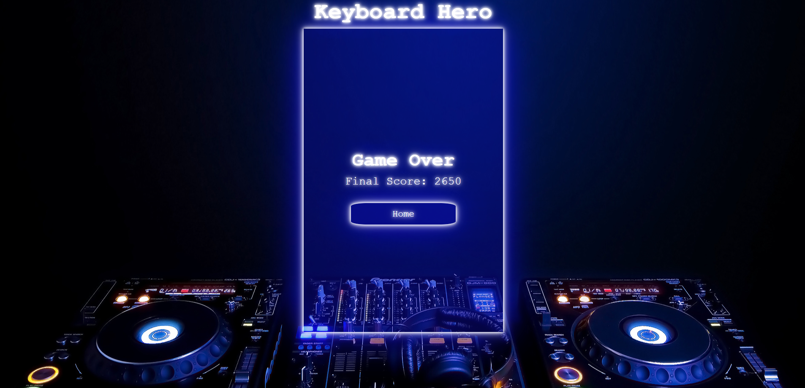

# keyboard-hero-v2

[Link to Live Site](https://asbaxter.github.io/keyboard-hero-v2/)

## Main Menu

## Gameplay

## Game Over

## Features Coming Soon:
- animations for note hits
- more advanced note generation (read the audio and determine when to spawn note) 
- more advanced scoring alogrithim (impliment combos)
- add the user ability to upload their own audio files
- difficulty settings